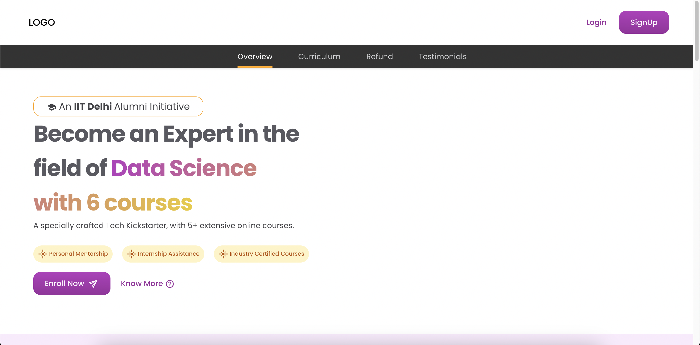

# Ed Tech Website - React Project

## Introduction

This project is a web application developed using React.js for an educational technology (Ed Tech) website. The purpose of this website is to provide an online platform for learning various courses, accessing educational resources, and connecting learners with instructors. The website aims to enhance the learning experience through interactive content, user-friendly interface, and personalized learning paths.

## Features

- **Course Catalog:** Browse through a wide range of courses categorized by subject, level, and duration.
- **User Authentication:** Secure user authentication system for registering, logging in, and managing user profiles.
- **Interactive Learning Materials:** Engaging learning materials including videos, quizzes, and interactive exercises.
- **Instructor Dashboard:** Dashboard for instructors to create and manage course content, track student progress, and communicate with students.
- **Discussion Forums:** Forums for students to ask questions, discuss topics, and interact with peers and instructors.
- **Progress Tracking:** Track your learning progress, completed courses, and achievements.
- **Responsive Design:** Responsive design ensures seamless user experience across devices of all sizes.

## Installation

To run the project locally, follow these steps:

1. Clone the repository to your local machine.

2. Navigate to the project directory.
- cd ed-tech-website

3. Install dependencies.

4. Start the development server.

5. Open your browser and navigate to `http://localhost:3000` to view the website.

## Technologies Used

- **React.js:** Front-end JavaScript library for building user interfaces.
- **HTML5 & CSS3:** Markup and styling languages for structuring and styling web pages.
- **JavaScript:** Programming language used for client-side scripting.
